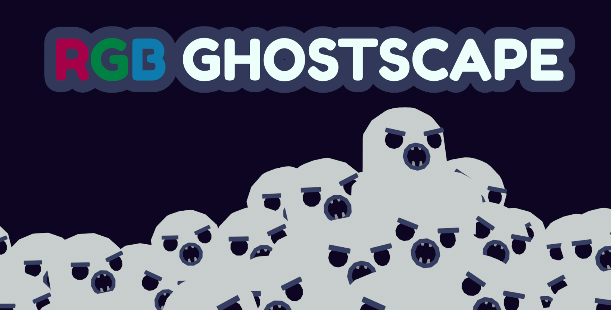
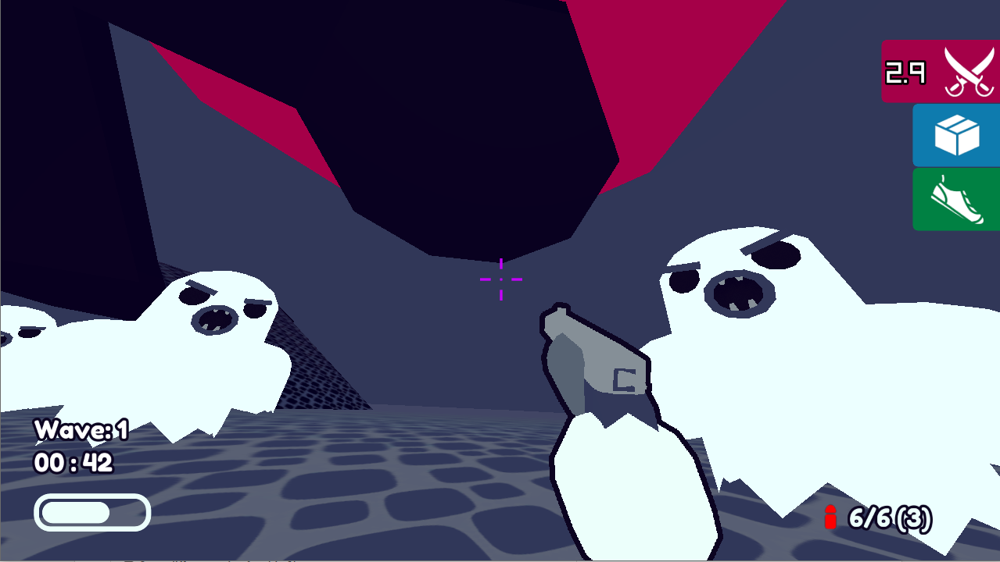
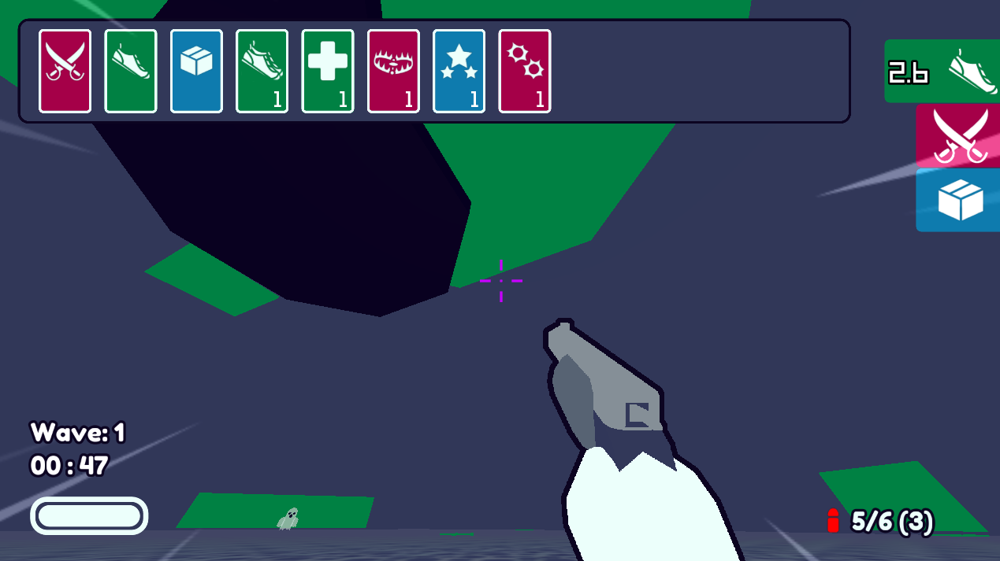
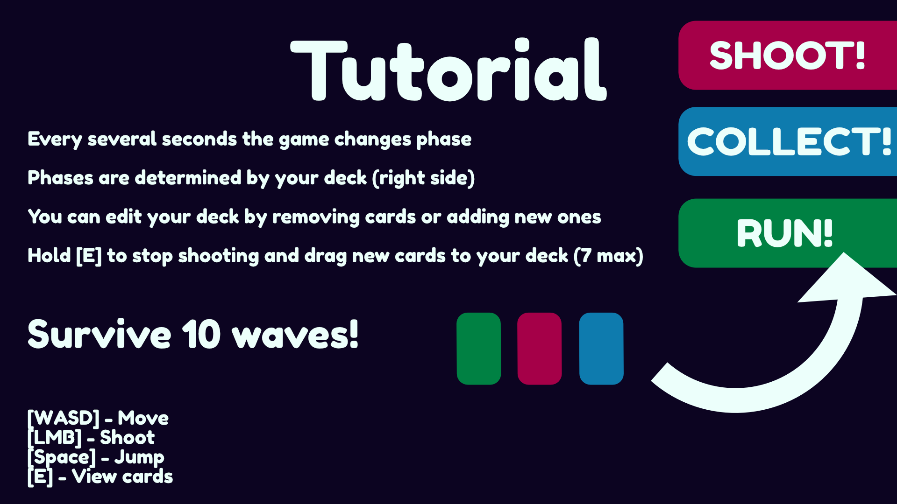

# RGB Ghostscape
### RGB Ghostscape is a game about buildin' decks, shootin' ghosts, and runnin' for your life!

### [Play the game!](https://tissueinu.itch.io/rgb-ghostscape)
------

### About

We built RGB Ghostscape as an entry to the 2022 7DFPS game jam, a casual jam about making an FPS in 7 days.

Making an FPS was a first for both of us, so we learned a ton about the small details about making these types of games. It was also our first 3D game in Godot, which came with its own challenges as well.

In terms of **lessons learned**, here's a list of stuff that we'll take into account in future projects:

- 3D asset workflows are painful to understand and nail. Exporting assets in .glb format from Blender and importing them in Godot created locked scenes that we had to use to create the ones we could modify in-game. We needed more time to understand the ins and outs of how this works, since we're pretty sure there has to be a better way.
- We had a lot of trouble while setting up a Navmesh inside Godot, and it turned out to be an asset that had flipped normals. Flipping them and re-exporting the asset fixed the issues but I know from now on we'll never forget to check the normals before exporting any asset from Blender.
- We started programming/creating assets a tad too early. We didn't fully understand the game loop we wanted to create before starting to program and we pushed on, blinded by our enthusiasm and our desire to start programming and seeing results. I think we just needed one more day of thinking about the core gameplay before getting our hands dirty. Useful to take into account for all future projects, as small and casual as they may be.
- Limiting the visuals of the game to a very small palette helped a lot when creating new assets. Since the array of colors was so limited, it was pretty easy to understand which ones would work and which ones wouldn't. I believe this is one of the most important takeaways for teams without strong art backgrounds, such as ourselves. We're very happy with how the visuals turned out!
- Sprinkling a bit of game feel into the project throughout the week was a good idea in our opinion. Stuff like crosshair scaling on shooting, enemy hit effects, speedlines and steps sound variation all make the game feel a lot more alive.
- The projects code architecture is solid for it being our first 3D project. There is room for a lot of improvement, but navigating the project was easy at all times and we never stumbled upon situations where we felt icky about the decisions we were making.
- Setting up a very flexible card system using resources early on was one of the best decisions we made. It offered a lot of possibilities to create new, more interesting cards in the last days, which gave the game a lot of different possibilities gameplay-wise.

------

### Credits

Developers:

- [Cai](https://github.com/CaiClone)
- [Tissue Inu](https://github.com/joancardonasa)

Other:

- RetroMagic by [Kamyab Nazari](https://github.com/kamyabnz)
- Music by [Karl Casey @ White Bat Audio](https://www.youtube.com/@WhiteBatAudio)
- Card Icons made by Delapouite and Lorc. Available on https://game-icons.net
- Crosshairs and Card sounds by kenney @ https://kenney.nl

------

### Screenshots

